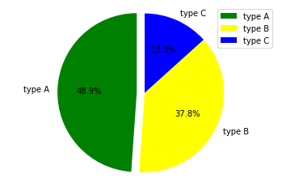
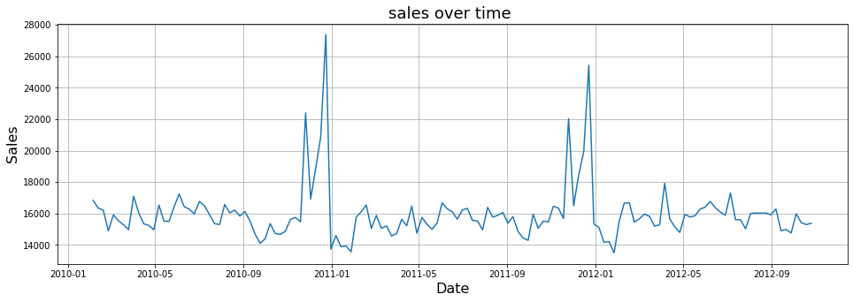
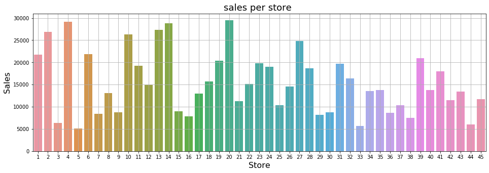
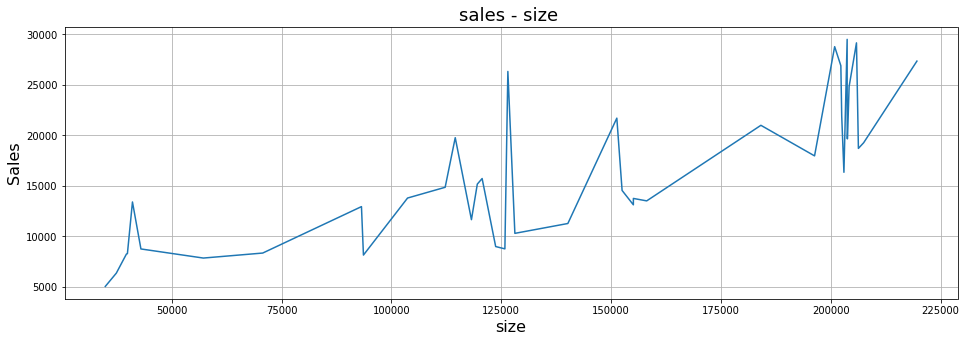
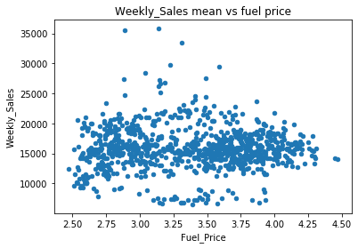
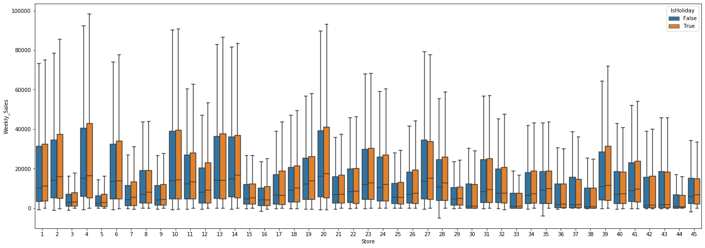
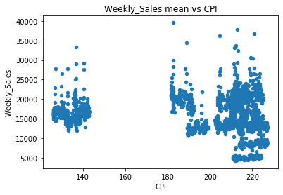

# Walmart Recruiting - Store Sales Forecasting
## Technical assestment | Neaam Hariri 


#### Probelm statment
In this recruiting competition, job-seekers are provided with historical sales data for 45 Walmart stores located in different regions. Each store contains many departments, and participants must project the sales for each department in each store. To add to the challenge, selected holiday markdown events are included in the dataset. These markdowns are known to affect sales, but it is challenging to predict which departments are affected and the extent of the impact.

##### Source : [Link to dataset](https://www.kaggle.com/c/walmart-recruiting-store-sales-forecasting/overview)

#### Dataset :    
<ol>
<li>stores.csv</li>
<li>features.csv</li>
<li>train.csv</li>
 <li>sampleSubmission.csv</li>
</ol>

#### table of content 
<ol>
<li>download data</li>
<li>explore data</li>
<li>data cleaning</li>
    <li>visualizing</li>
     <li>findings</li>

</ol>


```python
import pandas as pd
import numpy as np
import matplotlib.pyplot as plt
%matplotlib inline
import seaborn as sns


```

### Loading and exploring the data


```python
#Read CSV file 
df_features = pd.read_csv('features.csv', sep=',')
df_stores = pd.read_csv('stores.csv', sep=',')
df_train = pd.read_csv('train.csv', sep=',')
df_test = pd.read_csv('test.csv', sep=',') 
```


```python
df_features.info()
df_features.head()
```

    <class 'pandas.core.frame.DataFrame'>
    RangeIndex: 8190 entries, 0 to 8189
    Data columns (total 12 columns):
    Store           8190 non-null int64
    Date            8190 non-null object
    Temperature     8190 non-null float64
    Fuel_Price      8190 non-null float64
    MarkDown1       4032 non-null float64
    MarkDown2       2921 non-null float64
    MarkDown3       3613 non-null float64
    MarkDown4       3464 non-null float64
    MarkDown5       4050 non-null float64
    CPI             7605 non-null float64
    Unemployment    7605 non-null float64
    IsHoliday       8190 non-null bool
    dtypes: bool(1), float64(9), int64(1), object(1)
    memory usage: 711.9+ KB
    


<div>

<table border="1" class="dataframe">
  <thead>
    <tr style="text-align: right;">
      <th></th>
      <th>Store</th>
      <th>Date</th>
      <th>Temperature</th>
      <th>Fuel_Price</th>
      <th>MarkDown1</th>
      <th>MarkDown2</th>
      <th>MarkDown3</th>
      <th>MarkDown4</th>
      <th>MarkDown5</th>
      <th>CPI</th>
      <th>Unemployment</th>
      <th>IsHoliday</th>
    </tr>
  </thead>
  <tbody>
    <tr>
      <th>0</th>
      <td>1</td>
      <td>2010-02-05</td>
      <td>42.31</td>
      <td>2.572</td>
      <td>NaN</td>
      <td>NaN</td>
      <td>NaN</td>
      <td>NaN</td>
      <td>NaN</td>
      <td>211.096358</td>
      <td>8.106</td>
      <td>False</td>
    </tr>
    <tr>
      <th>1</th>
      <td>1</td>
      <td>2010-02-12</td>
      <td>38.51</td>
      <td>2.548</td>
      <td>NaN</td>
      <td>NaN</td>
      <td>NaN</td>
      <td>NaN</td>
      <td>NaN</td>
      <td>211.242170</td>
      <td>8.106</td>
      <td>True</td>
    </tr>
    <tr>
      <th>2</th>
      <td>1</td>
      <td>2010-02-19</td>
      <td>39.93</td>
      <td>2.514</td>
      <td>NaN</td>
      <td>NaN</td>
      <td>NaN</td>
      <td>NaN</td>
      <td>NaN</td>
      <td>211.289143</td>
      <td>8.106</td>
      <td>False</td>
    </tr>
    <tr>
      <th>3</th>
      <td>1</td>
      <td>2010-02-26</td>
      <td>46.63</td>
      <td>2.561</td>
      <td>NaN</td>
      <td>NaN</td>
      <td>NaN</td>
      <td>NaN</td>
      <td>NaN</td>
      <td>211.319643</td>
      <td>8.106</td>
      <td>False</td>
    </tr>
    <tr>
      <th>4</th>
      <td>1</td>
      <td>2010-03-05</td>
      <td>46.50</td>
      <td>2.625</td>
      <td>NaN</td>
      <td>NaN</td>
      <td>NaN</td>
      <td>NaN</td>
      <td>NaN</td>
      <td>211.350143</td>
      <td>8.106</td>
      <td>False</td>
    </tr>
  </tbody>
</table>
</div>


```python
df_stores.info()
df_stores.head()
```

    <class 'pandas.core.frame.DataFrame'>
    RangeIndex: 45 entries, 0 to 44
    Data columns (total 3 columns):
    Store    45 non-null int64
    Type     45 non-null object
    Size     45 non-null int64
    dtypes: int64(2), object(1)
    memory usage: 1.1+ KB
    


<div>
<style scoped>
    .dataframe tbody tr th:only-of-type {
        vertical-align: middle;
    }

    .dataframe tbody tr th {
        vertical-align: top;
    }

    .dataframe thead th {
        text-align: right;
    }
</style>
<table border="1" class="dataframe">
  <thead>
    <tr style="text-align: right;">
      <th></th>
      <th>Store</th>
      <th>Type</th>
      <th>Size</th>
    </tr>
  </thead>
  <tbody>
    <tr>
      <th>0</th>
      <td>1</td>
      <td>A</td>
      <td>151315</td>
    </tr>
    <tr>
      <th>1</th>
      <td>2</td>
      <td>A</td>
      <td>202307</td>
    </tr>
    <tr>
      <th>2</th>
      <td>3</td>
      <td>B</td>
      <td>37392</td>
    </tr>
    <tr>
      <th>3</th>
      <td>4</td>
      <td>A</td>
      <td>205863</td>
    </tr>
    <tr>
      <th>4</th>
      <td>5</td>
      <td>B</td>
      <td>34875</td>
    </tr>
  </tbody>
</table>
</div>


```python
df_train.info()
df_train.head()
```

    <class 'pandas.core.frame.DataFrame'>
    RangeIndex: 421570 entries, 0 to 421569
    Data columns (total 5 columns):
    Store           421570 non-null int64
    Dept            421570 non-null int64
    Date            421570 non-null object
    Weekly_Sales    421570 non-null float64
    IsHoliday       421570 non-null bool
    dtypes: bool(1), float64(1), int64(2), object(1)
    memory usage: 13.3+ MB
    


<div>
<style scoped>
    .dataframe tbody tr th:only-of-type {
        vertical-align: middle;
    }

    .dataframe tbody tr th {
        vertical-align: top;
    }

    .dataframe thead th {
        text-align: right;
    }
</style>
<table border="1" class="dataframe">
  <thead>
    <tr style="text-align: right;">
      <th></th>
      <th>Store</th>
      <th>Dept</th>
      <th>Date</th>
      <th>Weekly_Sales</th>
      <th>IsHoliday</th>
    </tr>
  </thead>
  <tbody>
    <tr>
      <th>0</th>
      <td>1</td>
      <td>1</td>
      <td>2010-02-05</td>
      <td>24924.50</td>
      <td>False</td>
    </tr>
    <tr>
      <th>1</th>
      <td>1</td>
      <td>1</td>
      <td>2010-02-12</td>
      <td>46039.49</td>
      <td>True</td>
    </tr>
    <tr>
      <th>2</th>
      <td>1</td>
      <td>1</td>
      <td>2010-02-19</td>
      <td>41595.55</td>
      <td>False</td>
    </tr>
    <tr>
      <th>3</th>
      <td>1</td>
      <td>1</td>
      <td>2010-02-26</td>
      <td>19403.54</td>
      <td>False</td>
    </tr>
    <tr>
      <th>4</th>
      <td>1</td>
      <td>1</td>
      <td>2010-03-05</td>
      <td>21827.90</td>
      <td>False</td>
    </tr>
  </tbody>
</table>
</div>


```python
df_test.info()
df_test.head()
```

    <class 'pandas.core.frame.DataFrame'>
    RangeIndex: 115064 entries, 0 to 115063
    Data columns (total 4 columns):
    Store        115064 non-null int64
    Dept         115064 non-null int64
    Date         115064 non-null object
    IsHoliday    115064 non-null bool
    dtypes: bool(1), int64(2), object(1)
    memory usage: 2.7+ MB
    


<div>
<style scoped>
    .dataframe tbody tr th:only-of-type {
        vertical-align: middle;
    }

    .dataframe tbody tr th {
        vertical-align: top;
    }

    .dataframe thead th {
        text-align: right;
    }
</style>
<table border="1" class="dataframe">
  <thead>
    <tr style="text-align: right;">
      <th></th>
      <th>Store</th>
      <th>Dept</th>
      <th>Date</th>
      <th>IsHoliday</th>
    </tr>
  </thead>
  <tbody>
    <tr>
      <th>0</th>
      <td>1</td>
      <td>1</td>
      <td>2012-11-02</td>
      <td>False</td>
    </tr>
    <tr>
      <th>1</th>
      <td>1</td>
      <td>1</td>
      <td>2012-11-09</td>
      <td>False</td>
    </tr>
    <tr>
      <th>2</th>
      <td>1</td>
      <td>1</td>
      <td>2012-11-16</td>
      <td>False</td>
    </tr>
    <tr>
      <th>3</th>
      <td>1</td>
      <td>1</td>
      <td>2012-11-23</td>
      <td>True</td>
    </tr>
    <tr>
      <th>4</th>
      <td>1</td>
      <td>1</td>
      <td>2012-11-30</td>
      <td>False</td>
    </tr>
  </tbody>
</table>
</div>


### Converting to appropriate datatype, checking null values


```python
# converting date to datetime object 
#df_features['Date'] = df_features['Date'].apply(pd.to_datetime)
print(f"Minimum Date: {min(df_features['Date'])}")
print(f"\nMaximum Date: {max(df_features['Date'])}")
```

    Minimum Date: 2010-02-05
    
    Maximum Date: 2013-07-26
    


```python
#check null values 
df_features.isnull().sum()

```


    Store              0
    Date               0
    Temperature        0
    Fuel_Price         0
    MarkDown1       4158
    MarkDown2       5269
    MarkDown3       4577
    MarkDown4       4726
    MarkDown5       4140
    CPI              585
    Unemployment     585
    IsHoliday          0
    dtype: int64


```python
df_features.fillna(0,inplace=True)
df_features.isnull().sum()
```


    Store           0
    Date            0
    Temperature     0
    Fuel_Price      0
    MarkDown1       0
    MarkDown2       0
    MarkDown3       0
    MarkDown4       0
    MarkDown5       0
    CPI             0
    Unemployment    0
    IsHoliday       0
    dtype: int64


```python
df_features[["Temperature"]] = df_features[["Temperature"]].fillna(df_features[["Temperature"]].mean())
df_features[["Fuel_Price"]] = df_features[["Fuel_Price"]].fillna(df_features[["Fuel_Price"]].mean())
df_features[["CPI"]] = df_features[["CPI"]].fillna(df_features[["CPI"]].mean())
```


```python
df_features.isnull().sum()
```


    Store           0
    Date            0
    Temperature     0
    Fuel_Price      0
    MarkDown1       0
    MarkDown2       0
    MarkDown3       0
    MarkDown4       0
    MarkDown5       0
    CPI             0
    Unemployment    0
    IsHoliday       0
    dtype: int64


```python
print(f"Minimum Date: {min(df_train['Date'])}")
print(f"\nMaximum Date: {max(df_train['Date'])}")
```

    Minimum Date: 2010-02-05
    
    Maximum Date: 2012-10-26
    


```python
df_train.isnull().sum()
```


    Store           0
    Dept            0
    Date            0
    Weekly_Sales    0
    IsHoliday       0
    dtype: int64


```python
labels = 'type A','type B','type C'
sizes = [(df_stores.Type.value_counts()['A']/(45))*100,(df_stores.Type.value_counts()['B']/(45))*100,(df_stores.Type.value_counts()['C']/(45))*100]
colors = ['green', 'yellow', 'blue']
explode = (0.1, 0, 0)  

plt.pie(sizes, explode=explode, labels=labels, colors=colors,
autopct='%.1f%%', shadow=False, startangle=90)
plt.legend(labels, loc="best")
plt.axis('equal')
plt.show()
```





```python
df_stores.Type.value_counts()
```


    A    22
    B    17
    C     6
    Name: Type, dtype: int64


### Merging stores, features, train in one dateframe


```python
df_features_stores = df_features.merge(df_stores, how='inner', on='Store')
df = df_train.merge(df_features_stores, how='inner', on=['Store','Date','IsHoliday'])

df['Date'] = pd.to_datetime(df['Date'])


df.info()
```

    <class 'pandas.core.frame.DataFrame'>
    Int64Index: 421570 entries, 0 to 421569
    Data columns (total 16 columns):
    Store           421570 non-null int64
    Dept            421570 non-null int64
    Date            421570 non-null datetime64[ns]
    Weekly_Sales    421570 non-null float64
    IsHoliday       421570 non-null bool
    Temperature     421570 non-null float64
    Fuel_Price      421570 non-null float64
    MarkDown1       421570 non-null float64
    MarkDown2       421570 non-null float64
    MarkDown3       421570 non-null float64
    MarkDown4       421570 non-null float64
    MarkDown5       421570 non-null float64
    CPI             421570 non-null float64
    Unemployment    421570 non-null float64
    Type            421570 non-null object
    Size            421570 non-null int64
    dtypes: bool(1), datetime64[ns](1), float64(10), int64(3), object(1)
    memory usage: 51.9+ MB
    


```python
df["year"] = df["Date"].dt.year
df["month"] = df["Date"].dt.month
df["week"] = df["Date"].dt.month
```


```python

```

### sales visualizations


```python
sales_date = df['Weekly_Sales'].groupby(df['Date']).mean()

plt.figure(figsize=(16,5))
sns.lineplot(weekly_sales_mean.index, weekly_sales_mean.values)

plt.grid()
plt.title('sales over time ', fontsize=18)
plt.ylabel('Sales', fontsize=16)
plt.xlabel('Date', fontsize=16)
plt.show()
```





```python
sales_store = df['Weekly_Sales'].groupby(df['Store']).mean()

plt.figure(figsize=(16,5))
sns.barplot(sales_store.index, sales_store.values)

plt.grid()
plt.title('sales per store ', fontsize=18)
plt.ylabel('Sales', fontsize=16)
plt.xlabel('Store', fontsize=16)
plt.show()

```





```python
sales_store.min()

```


    5053.415812868089


```python
sales_store.max()
```


    29508.30159193265


```python
sales_store.max() - sales_store.min()
```


    24454.88577906456


```python
df.groupby("Type")["Weekly_Sales"].mean()
```


    Type
    A    20099.568043
    B    12237.075977
    C     9519.532538
    Name: Weekly_Sales, dtype: float64


```python
# # Figure Size
# fig = plt.figure(figsize =(10, 7))
# # Horizontal Bar Plot
# plt.bar(df.Store, df.Weekly_Sales)
# # Show Plot
# plt.show()
```


```python
hol = df['Weekly_Sales'].groupby(df['Size']).mean()

plt.figure(figsize=(16,5))
sns.lineplot(hol.index, hol.values)

plt.grid()
plt.title('sales - size ', fontsize=18)
plt.ylabel('Sales', fontsize=16)
plt.xlabel('size', fontsize=16)
plt.show()

```





```python

hol = df.groupby("Fuel_Price")["Weekly_Sales"].mean().reset_index()
print(hol["Fuel_Price"].corr(hol["Weekly_Sales"]))
hol.plot.scatter("Fuel_Price", "Weekly_Sales", title="Weekly_Sales mean vs fuel price")

```

    0.015810449498679695
    


    <matplotlib.axes._subplots.AxesSubplot at 0x1ea083c1da0>





```python
data = pd.concat([df['Store'], df['Weekly_Sales'], df['IsHoliday']], axis=1)
f, ax = plt.subplots(figsize=(23, 8))
fig = sns.boxplot(x='Store', y='Weekly_Sales', data=data, showfliers=False, hue="IsHoliday")
```





### We can see that holidays have higher weekly sales than non holidays  


```python

CPI_corr = df.groupby("CPI")["Weekly_Sales"].mean().reset_index()
print(CPI_corr["CPI"].corr(hol["Weekly_Sales"]))
CPI_corr.plot.scatter("CPI", "Weekly_Sales", title="Weekly_Sales mean vs CPI")

```

    -0.018861475583658933
    


    <matplotlib.axes._subplots.AxesSubplot at 0x1ea1563b400>





```python
holidays = df[['Weekly_Sales','Date','week','year','IsHoliday']]
holidays = holidays.loc[holidays['IsHoliday']==True].drop_duplicates()
holidays.head()
```


<div>
<style scoped>
    .dataframe tbody tr th:only-of-type {
        vertical-align: middle;
    }

    .dataframe tbody tr th {
        vertical-align: top;
    }

    .dataframe thead th {
        text-align: right;
    }
</style>
<table border="1" class="dataframe">
  <thead>
    <tr style="text-align: right;">
      <th></th>
      <th>Weekly_Sales</th>
      <th>Date</th>
      <th>week</th>
      <th>year</th>
      <th>IsHoliday</th>
    </tr>
  </thead>
  <tbody>
    <tr>
      <th>73</th>
      <td>46039.49</td>
      <td>2010-02-12</td>
      <td>2</td>
      <td>2010</td>
      <td>True</td>
    </tr>
    <tr>
      <th>74</th>
      <td>44682.74</td>
      <td>2010-02-12</td>
      <td>2</td>
      <td>2010</td>
      <td>True</td>
    </tr>
    <tr>
      <th>75</th>
      <td>10887.84</td>
      <td>2010-02-12</td>
      <td>2</td>
      <td>2010</td>
      <td>True</td>
    </tr>
    <tr>
      <th>76</th>
      <td>35351.21</td>
      <td>2010-02-12</td>
      <td>2</td>
      <td>2010</td>
      <td>True</td>
    </tr>
    <tr>
      <th>77</th>
      <td>29620.81</td>
      <td>2010-02-12</td>
      <td>2</td>
      <td>2010</td>
      <td>True</td>
    </tr>
  </tbody>
</table>
</div>


##### 1- no correlation bteween sales and CPI or Fuel price 
##### 2- holidays have higher sales 
##### 3- bigger stores have higher sales over time 
##### 4- type A of stoers have the highest sales avarege while C have the lowst (logiclly because A is 48% of stores type)
#####  5- 24454.88577906456 is the different between the minimum (store 5) store's sales and the maximum (store 20)
#####  6- end of years have high weekly sales while first months have low weekly sales 
